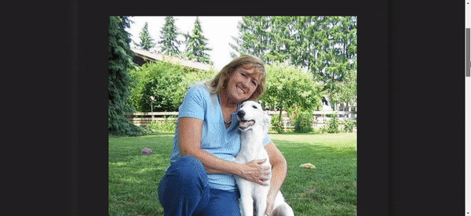

# Random Dog Picture Generator: [Visit Here](https://randomdogpicture.netlify.app/)

  

This simple site gets a random dog picture from the dog.ceo API and displays it on the click of the button or the load of the page. It also stores all the previously generated random image links the in the browser's local storage which can be cleared. It is available online for visit [here](https://randomdogpicture.netlify.app/)

### Purpose:

The purpose was to build a simple project using dogceo API and polish my skills while working with APIs. 

### Lessons Learned:

This was the first time when I tried to use responsive fontsize without using any media queries. While I still do think it may need a little improvement but it is definitely powerful. This is also the first time I have tried a neomorphism design. It seems futuristic and I am looking forward to using neomorphism style on many more future projects. 

### Languages and Tools:

 
### More Projects with API usage:

<table bordercolor="#66b2b2">
  
  <tr>
    <td width="50%"  style="align:center;" valign="top">
<a target="_blank" href="https://github.com/Alamicrodev/DrinksDirectory-Site">Drinks Directory</a>
         
      
    </td>

<td width="50%"  style="align:center;" valign="top">
<a target="_blank" href="https://github.com/Alamicrodev/Nasa_PictureOfTheDay-Site">Nasa POTD</a>
         
      
    </td>

  </tr>
</table> 